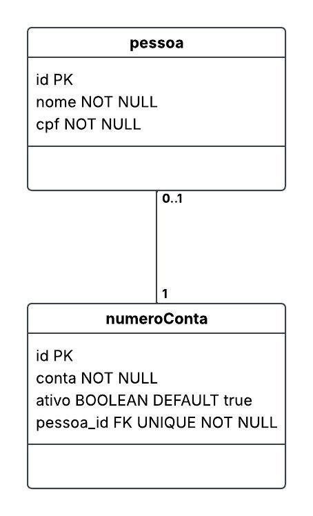

# Sistema Conta PostgreSQL

Projeto desenvolvido para estudos de PostgreSQL e modelagem
de banco de dados, utilizando um relacionamento entre as
entidades Pessoa e numeroConta, onde uma pessoa pode ter 
zero ou uma, e cada conta pertence a uma única pessoa(0..1 : 1).

O projeto aborda a criação e estruturação das tabelas, definição
de tipos de dados, chaves e relacionamento entre as entidades.

## Diagrama UML

